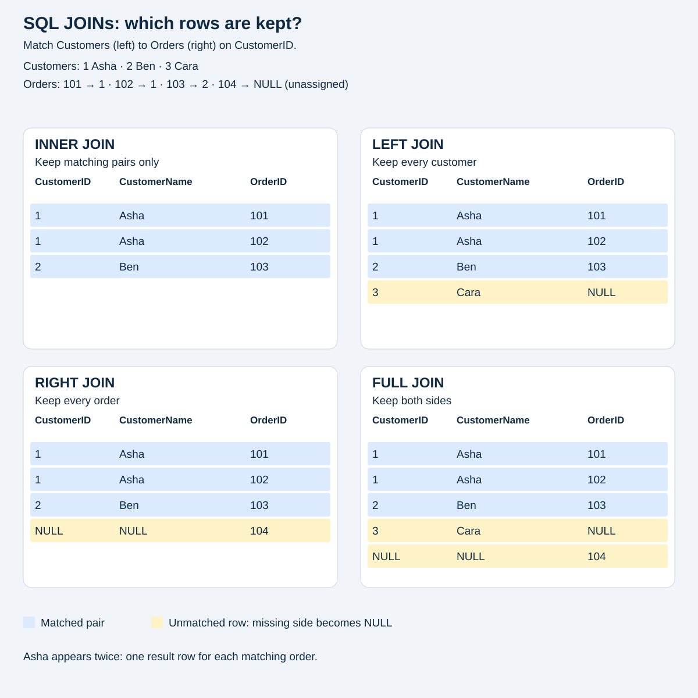

# SQL JOINs: a practical beginner’s guide

**Database:** Microsoft SQL Server (T-SQL), using Northwind.
**Purpose:** understand JOINs, practise the four main types and solve 15 reporting exercises.

## 1. What are JOINs?

A JOIN combines related rows from tables into a query result. For example, a customer’s name is stored in `Customers`, while their orders are stored in `Orders`. Joining the two lets us show the customer’s name next to each order.

A **primary key** uniquely identifies a row, such as `Customers.CustomerID`. A **foreign key** references a key in another table, such as `Orders.CustomerID`. These are useful columns to join on; a JOIN itself does not require a declared foreign key.

A `SELECT` with a JOIN reads the data. It does not merge the stored tables or change their contents.

## 2. How does a JOIN work?

```sql
SELECT c.CompanyName, o.OrderID
FROM dbo.Customers AS c
INNER JOIN dbo.Orders AS o
    ON c.CustomerID = o.CustomerID;
```

- `FROM` names the first (left) table.
- `JOIN` names the second (right) table and chooses which rows to keep.
- `ON` states the matching rule: here, equal customer IDs.
- `c` and `o` are short table aliases. `c.CustomerID` makes the source clear.
- `SELECT` chooses which columns to display.

Think of SQL finding every pair of rows that satisfies `ON`. If a customer has two orders, the customer appears twice: once for each matching order. SQL Server chooses its own efficient execution plan; this is a way to understand the result, not a promise about how it physically runs.

`NULL` means a missing or unknown value. An outer JOIN fills the missing side with `NULL` when it keeps an unmatched row. With an equality condition, `NULL` does not match another value, even another `NULL`.

### A small database to follow

**Customers (left)**

| CustomerID | CustomerName |
| --- | --- |
| 1 | Asha |
| 2 | Ben |
| 3 | Cara |

**Orders (right)**

| OrderID | CustomerID |
| --- | --- |
| 101 | 1 |
| 102 | 1 |
| 103 | 2 |
| 104 | NULL |

Cara has no orders. Order 104 is an unassigned example order, so it has no customer. This deliberate sample makes both unmatched cases visible.



The diagram shows actual result rows. Notice that Asha appears twice. JOINs match rows; they do not automatically remove duplicates.

| JOIN type | Matching pairs | Unmatched left rows | Unmatched right rows |
| --- | --- | --- | --- |
| INNER JOIN | Keep | Discard | Discard |
| LEFT JOIN | Keep | Keep | Discard |
| RIGHT JOIN | Keep | Discard | Keep |
| FULL JOIN | Keep | Keep | Keep |

`OUTER` is optional: `LEFT JOIN` and `LEFT OUTER JOIN` mean the same thing. This also applies to `RIGHT` and `FULL`.

### Run the small examples

Run this setup and the four queries below **together in one execution**. Table variables only exist within the current batch; do not insert `GO` between them. Alternatively, run [sql/simple-joins.sql](sql/simple-joins.sql).

```sql
-- Table variables exist only in this batch; Northwind is not changed.
DECLARE @Customers TABLE (CustomerID int PRIMARY KEY, CustomerName varchar(20));
DECLARE @Orders TABLE (OrderID int PRIMARY KEY, CustomerID int NULL);

INSERT INTO @Customers VALUES (1, 'Asha'), (2, 'Ben'), (3, 'Cara');
INSERT INTO @Orders VALUES (101, 1), (102, 1), (103, 2), (104, NULL);
```

### INNER JOIN — matching rows only

Use this when both sides must exist. Cara and order 104 are excluded.

```sql
SELECT c.CustomerID, c.CustomerName, o.OrderID
FROM @Customers AS c
INNER JOIN @Orders AS o ON c.CustomerID = o.CustomerID
ORDER BY COALESCE(c.CustomerID, 2147483647), o.OrderID;
```

**Expected result:**

| CustomerID | CustomerName | OrderID |
| --- | --- | --- |
| 1 | Asha | 101 |
| 1 | Asha | 102 |
| 2 | Ben | 103 |

### LEFT JOIN — every row from the left

Use this when every customer must appear, even without an order. Cara is kept with a NULL OrderID.

```sql
SELECT c.CustomerID, c.CustomerName, o.OrderID
FROM @Customers AS c
LEFT JOIN @Orders AS o ON c.CustomerID = o.CustomerID
ORDER BY COALESCE(c.CustomerID, 2147483647), o.OrderID;
```

**Expected result:**

| CustomerID | CustomerName | OrderID |
| --- | --- | --- |
| 1 | Asha | 101 |
| 1 | Asha | 102 |
| 2 | Ben | 103 |
| 3 | Cara | NULL |

### RIGHT JOIN — every row from the right

Use this when every order must appear. Order 104 is kept with NULL customer columns. Swapping the table order and using LEFT JOIN would give the same relationships.

```sql
SELECT c.CustomerID, c.CustomerName, o.OrderID
FROM @Customers AS c
RIGHT JOIN @Orders AS o ON c.CustomerID = o.CustomerID
ORDER BY COALESCE(c.CustomerID, 2147483647), o.OrderID;
```

**Expected result:**

| CustomerID | CustomerName | OrderID |
| --- | --- | --- |
| 1 | Asha | 101 |
| 1 | Asha | 102 |
| 2 | Ben | 103 |
| NULL | NULL | 104 |

### FULL JOIN — every row from both sides

Use this when you need matches and unmatched records from either side, such as reconciling two lists. Both Cara and order 104 are kept.

```sql
SELECT c.CustomerID, c.CustomerName, o.OrderID
FROM @Customers AS c
FULL JOIN @Orders AS o ON c.CustomerID = o.CustomerID
ORDER BY COALESCE(c.CustomerID, 2147483647), o.OrderID;
```

**Expected result:**

| CustomerID | CustomerName | OrderID |
| --- | --- | --- |
| 1 | Asha | 101 |
| 1 | Asha | 102 |
| 2 | Ben | 103 |
| 3 | Cara | NULL |
| NULL | NULL | 104 |

## 3. Why use JOINs?

Keeping customers, orders and products in separate tables avoids copying the same customer details into every order. This reduces repeated data and makes updates easier to keep consistent. JOINs let us put the relevant facts together when we need them.

They help answer questions such as: who placed an order, which products sold, which customers have never ordered, and which categories generated the most revenue. The same source tables can support many different reports.

## 4. Northwind exercise setup

In VS Code, connect through the SQL Server extension, select the **Northwind** database and run a query in a SQL editor. The complete runnable exercises are also in [sql/northwind-exercises.sql](sql/northwind-exercises.sql). These exercise queries only read the existing tables.

```sql
USE Northwind;
```

The names below match the inspected database. `dbo` is its schema. Square brackets are needed around `[Order Details]` because its name contains a space.

| Relationship | Join condition |
| --- | --- |
| Customer → orders | `Customers.CustomerID = Orders.CustomerID` |
| Order → order lines | `Orders.OrderID = [Order Details].OrderID` |
| Product → order lines | `Products.ProductID = [Order Details].ProductID` |
| Employee → orders | `Employees.EmployeeID = Orders.EmployeeID` |
| Category → products | `Categories.CategoryID = Products.CategoryID` |
| Shipper → orders | `Shippers.ShipperID = Orders.ShipVia` |

One order can contain several products, and a product can appear in many orders. `[Order Details]` connects them, recording quantity, price and discount for each line.

### Calculating money consistently

For these exercises, spend/revenue means the value of ordered products **after line discounts**, excluding freight and any tax. It does not establish whether an invoice has been paid or an order shipped.

```text
Line value = order-line unit price × quantity × (1 − discount)
Example: 10.00 × 3 × (1 − 0.10) = 27.00
```

Use `[Order Details].UnitPrice`, the historical price on the order, rather than `Products.UnitPrice`, the current catalogue price. Northwind stores `Discount` as an approximate `real` value, so these queries convert it to `decimal(5, 4)` before calculating. Four decimal places cover the discounts in this training dataset.

`SUM` adds the line values; `GROUP BY` makes a separate total for each order, customer or category. `COALESCE(value, 0)` supplies zero when there are no values to sum. The final `CAST(... AS decimal(19, 2))` displays money to two decimal places, rounding after aggregation. Exercise 12 also calculates averages before final rounding.

## 5. Exercise solutions

### 1. Customers Orders List

Keep every customer, including customers without orders. A customer appears once for each order; no order is shown as NULL.

```sql
SELECT c.CustomerID, c.CompanyName, o.OrderID
FROM dbo.Customers AS c
LEFT JOIN dbo.Orders AS o ON c.CustomerID = o.CustomerID
ORDER BY c.CustomerID, o.OrderID;
```

### 2. Orders with Customer Names

Match each order to its customer.

```sql
SELECT o.OrderID, o.OrderDate, c.CompanyName
FROM dbo.Orders AS o
INNER JOIN dbo.Customers AS c ON o.CustomerID = c.CustomerID
ORDER BY o.OrderID;
```

### 3. Orders with Product Names

Order Details connects orders to products. Each result row is one order line.

```sql
SELECT od.OrderID, p.ProductName, od.Quantity
FROM dbo.[Order Details] AS od
INNER JOIN dbo.Products AS p ON od.ProductID = p.ProductID
ORDER BY od.OrderID, p.ProductID;
```

### 4. Order Totals

Add the discounted order lines together. LEFT JOIN keeps even an order with no lines, giving it a total of zero.

```sql
SELECT o.OrderID,
       CAST(COALESCE(SUM(od.UnitPrice * od.Quantity * (1 - CAST(od.Discount AS decimal(5, 4)))), 0) AS decimal(19, 2)) AS OrderTotal
FROM dbo.Orders AS o
LEFT JOIN dbo.[Order Details] AS od ON o.OrderID = od.OrderID
GROUP BY o.OrderID
ORDER BY o.OrderID;
```

### 5. Total Spend per Customer

Keep all customers and add their discounted order lines. Customers with no orders have zero spend.

```sql
SELECT c.CustomerID, c.CompanyName,
       CAST(COALESCE(SUM(od.UnitPrice * od.Quantity * (1 - CAST(od.Discount AS decimal(5, 4)))), 0) AS decimal(19, 2)) AS TotalSpend
FROM dbo.Customers AS c
LEFT JOIN dbo.Orders AS o ON c.CustomerID = o.CustomerID
LEFT JOIN dbo.[Order Details] AS od ON o.OrderID = od.OrderID
GROUP BY c.CustomerID, c.CompanyName
ORDER BY c.CustomerID;
```

### 6. Customers with No Orders

After a LEFT JOIN, a missing order has a NULL OrderID. Test with IS NULL, not = NULL.

```sql
SELECT c.CustomerID, c.CompanyName
FROM dbo.Customers AS c
LEFT JOIN dbo.Orders AS o ON c.CustomerID = o.CustomerID
WHERE o.OrderID IS NULL
ORDER BY c.CustomerID;
```

### 7. Products Never Ordered

Keep products whose ProductID has no matching order line.

```sql
SELECT p.ProductID, p.ProductName
FROM dbo.Products AS p
LEFT JOIN dbo.[Order Details] AS od ON p.ProductID = od.ProductID
WHERE od.ProductID IS NULL
ORDER BY p.ProductID;
```

### 8. Orders per Employee

COUNT(o.OrderID) counts actual orders and returns zero for an employee without orders. COUNT(*) would incorrectly count the unmatched row as one.

```sql
SELECT e.EmployeeID, e.FirstName, e.LastName,
       COUNT(o.OrderID) AS NumberOfOrders
FROM dbo.Employees AS e
LEFT JOIN dbo.Orders AS o ON e.EmployeeID = o.EmployeeID
GROUP BY e.EmployeeID, e.FirstName, e.LastName
ORDER BY e.EmployeeID;
```

### 9. Top 5 Customers by Spend

Return five customers with orders, highest spend first. CustomerID breaks ties consistently.

```sql
SELECT TOP (5) c.CustomerID, c.CompanyName,
       CAST(COALESCE(SUM(od.UnitPrice * od.Quantity * (1 - CAST(od.Discount AS decimal(5, 4)))), 0) AS decimal(19, 2)) AS TotalSpend
FROM dbo.Customers AS c
INNER JOIN dbo.Orders AS o ON c.CustomerID = o.CustomerID
INNER JOIN dbo.[Order Details] AS od ON o.OrderID = od.OrderID
GROUP BY c.CustomerID, c.CompanyName
ORDER BY SUM(od.UnitPrice * od.Quantity * (1 - CAST(od.Discount AS decimal(5, 4)))) DESC, c.CustomerID;
```

### 10. Revenue by Category

Follow category → product → order line. LEFT JOIN keeps categories with no sales.

```sql
SELECT cat.CategoryID, cat.CategoryName,
       CAST(COALESCE(SUM(od.UnitPrice * od.Quantity * (1 - CAST(od.Discount AS decimal(5, 4)))), 0) AS decimal(19, 2)) AS Revenue
FROM dbo.Categories AS cat
LEFT JOIN dbo.Products AS p ON cat.CategoryID = p.CategoryID
LEFT JOIN dbo.[Order Details] AS od ON p.ProductID = od.ProductID
GROUP BY cat.CategoryID, cat.CategoryName
ORDER BY cat.CategoryID;
```

### 11. Full Order Breakdown

One row per order line, with the customer, product and price charged when the order was placed.

```sql
SELECT o.OrderID,
       c.CompanyName AS CustomerName,
       p.ProductName,
       od.Quantity,
       od.UnitPrice
FROM dbo.Orders AS o
INNER JOIN dbo.Customers AS c ON o.CustomerID = c.CustomerID
INNER JOIN dbo.[Order Details] AS od ON o.OrderID = od.OrderID
INNER JOIN dbo.Products AS p ON od.ProductID = p.ProductID
ORDER BY o.OrderID, p.ProductID;
```

### 12. Average Order Value per Customer

First calculate one total per order, then calculate customer statistics. The common table expression (CTE) named OrderTotals is a temporary named query result. This prevents an order with many lines from being counted several times. A customer with no orders has zero orders, zero spend and a NULL average because no average exists.

```sql
WITH OrderTotals AS (
    SELECT o.OrderID, o.CustomerID,
           COALESCE(SUM(od.UnitPrice * od.Quantity * (1 - CAST(od.Discount AS decimal(5, 4)))), 0) AS OrderTotal
    FROM dbo.Orders AS o
    LEFT JOIN dbo.[Order Details] AS od ON o.OrderID = od.OrderID
    GROUP BY o.OrderID, o.CustomerID
)
SELECT c.CustomerID, c.CompanyName,
       COUNT(ot.OrderID) AS NumberOfOrders,
       CAST(COALESCE(SUM(ot.OrderTotal), 0) AS decimal(19, 2)) AS TotalSpend,
       CAST(AVG(ot.OrderTotal) AS decimal(19, 2)) AS AverageOrderValue
FROM dbo.Customers AS c
LEFT JOIN OrderTotals AS ot ON c.CustomerID = ot.CustomerID
GROUP BY c.CustomerID, c.CompanyName
ORDER BY c.CustomerID;
```

### 13. Employees with No Orders

Use the same unmatched-row pattern as exercise 6.

```sql
SELECT e.EmployeeID, e.FirstName, e.LastName
FROM dbo.Employees AS e
LEFT JOIN dbo.Orders AS o ON e.EmployeeID = o.EmployeeID
WHERE o.OrderID IS NULL
ORDER BY e.EmployeeID;
```

### 14. Most Popular Product

Popularity here means total units ordered, not the number of order lines. WITH TIES returns every product tied for the highest quantity.

```sql
SELECT TOP (1) WITH TIES p.ProductID, p.ProductName,
       SUM(od.Quantity) AS TotalQuantityOrdered
FROM dbo.Products AS p
INNER JOIN dbo.[Order Details] AS od ON p.ProductID = od.ProductID
GROUP BY p.ProductID, p.ProductName
ORDER BY SUM(od.Quantity) DESC;
```

### 15. Orders with Shipping Company

Orders.ShipVia refers to Shippers.ShipperID. Keep every order, even when no shipper has been assigned.

```sql
SELECT o.OrderID, s.CompanyName AS ShipperName
FROM dbo.Orders AS o
LEFT JOIN dbo.Shippers AS s ON o.ShipVia = s.ShipperID
ORDER BY o.OrderID;
```

## 6. Common mistakes to avoid

- **Wrong join key:** join IDs that represent the same relationship, not unrelated IDs or company names.
- **Unexpected extra rows:** check whether you joined one order to several lines. This is expected, but can inflate counts or repeat order-level amounts such as freight.
- **Losing unmatched rows:** after a LEFT JOIN, a `WHERE` condition that requires a value from the right-hand table can remove unmatched rows. Put a condition in `ON` when it should restrict the matches while preserving every left-hand row.
- **Incorrect counts:** use `COUNT(o.OrderID)` for orders, not `COUNT(*)` after a LEFT JOIN. If order lines are also joined, consider `COUNT(DISTINCT o.OrderID)` or aggregate to one row per order first.
- **Grouping only by name:** different customers can share a name. Group by CustomerID and CompanyName together.
- **Averaging lines instead of orders:** an average line value is not an average order value. Exercise 12 totals each order first.
- **Empty results:** “never ordered” queries can correctly return no rows when every product or employee has orders.

## 7. Check your understanding

Before sharing the work, practise explaining why Asha appears twice, why Cara remains in a LEFT JOIN, why `COUNT(*)` can be misleading, and why an average of order lines is not an average of orders. Change the small sample data and predict each result before running it.

This is an AI-assisted worked training guide. Review and run the queries yourself, and follow your course’s rules on acknowledging assistance.

## 8. References

- [Microsoft Learn: SQL Server JOIN fundamentals](https://learn.microsoft.com/en-us/sql/relational-databases/performance/joins?view=sql-server-ver17) — syntax, matching conditions and aliases.
- [Microsoft Learn: TOP and WITH TIES](https://learn.microsoft.com/en-us/sql/t-sql/queries/top-transact-sql?view=sql-server-ver17) — limiting and ranking results.

See [VALIDATION.md](VALIDATION.md) for checks against the local training database.
